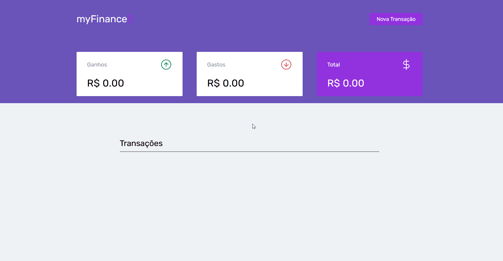
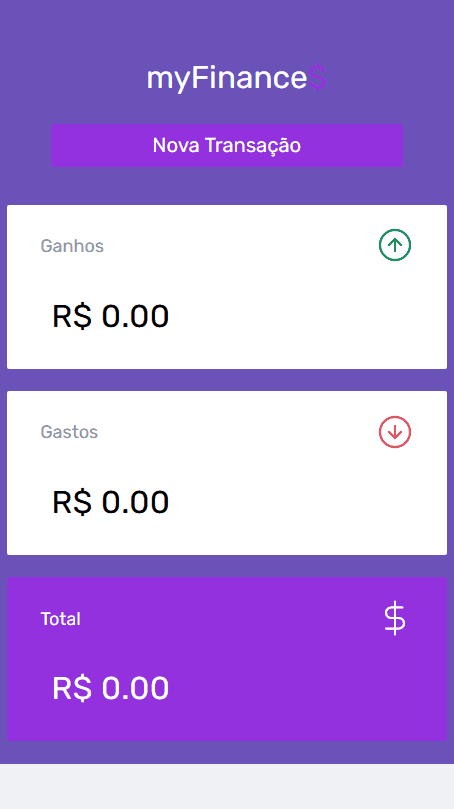

<h1 align="center">
    myFinances
</h1>

<h4 align="center"> 
	Concluído 🚀
</h4>


## 🎨 Layout

O layout da aplicação:

### Web

<p align="center" style="display: flex; align-items: flex-start; justify-content: center;">
  
</p>

### Mobile

<p align="center">
  
</p>

---
<br>

## 💻 Sobre o projeto

♻️ myFinances - é uma web app de fianças para auxiliar os usuarios com controle finaceiro.

---
<br>

## ⚙️ Funcionalidades

- [x] Usuario pode cadastrar as tramsações
  - [x] Colocar o nome da transação
  - [x] Colocar o valor da transação
- [x] Valores são atualizados no tempo real
- [x] Usuario pode apagar transações
- [x] Dados ficam salvos no Local Storage
---
<br>

## 🛠 Tecnologias

As seguintes ferramentas foram usadas na construção do projeto:

-   **[HTML5](https://github.com/topics/html5)**
-   **[CSS3](https://github.com/topics/css)**
-   **[JAVASCRIPT](https://github.com/topics/javascript)**
---
<br>

## 🚀 Como executar o projeto

-   Você pode testar o projeto aqui: **[myFinances Live](https://github.com/topics/html5)**

```bash

# Clone este repositório
$ git clone https://github.com/lucassoares01/my-finances

```

---
